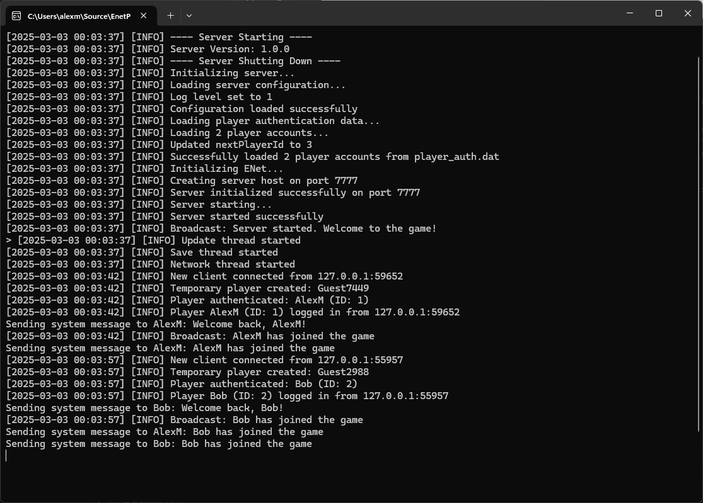
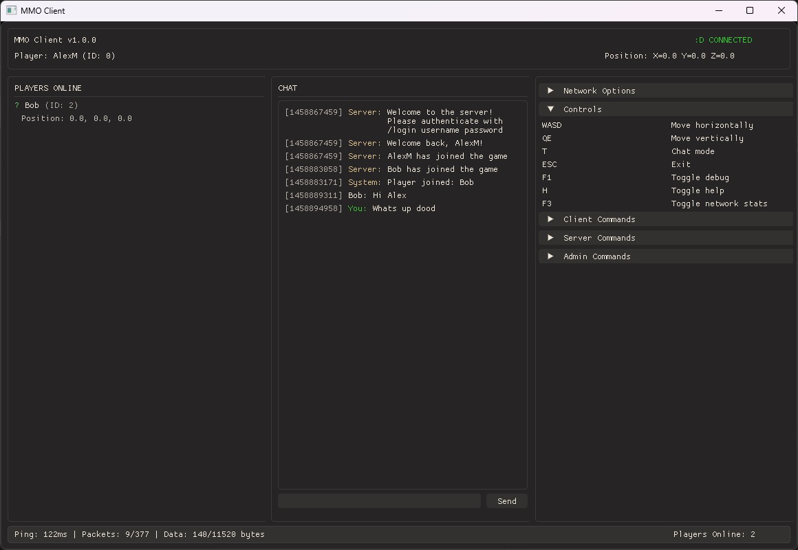

<div align="center">
  <h1>🎮 EnetPlayGround</h1>
  <p><strong>My personal networking sandbox where packets go to play!</strong></p>
  
  <p>
    <a href="#-cool-stuff-im-playing-with">Cool Stuff</a> •
    <a href="#-screenshots">Screenshots</a> •
    <a href="#-the-grand-blueprint">The Blueprint</a> •
    <a href="#-how-to-join-the-fun">Get It Running</a> •
    <a href="#-lets-play">Play With It</a> •
    <a href="#-things-im-working-on">Work In Progress</a> •
    <a href="#-experiment-ideas">Break Things</a>
  </p>
  
  
  
  
  
</div>

---

## 📋 About

Welcome to my networking playground! This is where I throw code at the wall and see what sticks. EnetPlayGround is my personal laboratory for experimenting with the ENet reliable UDP networking library. Will it work? Maybe! Will it crash? Probably! Is it fun? I guess.

I actually made this project because I have been playing alot of mmo's and wanted to see how difficult it would be to make a simple mmo game, because every programmer has heard how difficult they are to make. I have no idea what I am doing but I am having fun and learning alot.

## ✨ Cool Stuff I'm Playing With

<table>
  <tr>
    <td width="50%">
      <h3>Server Magic ✨</h3>
      <ul>
        <li>Juggling multiple clients without dropping them</li>
        <li>Events that sometimes fire when they should</li>
        <li>Packets that (usually) arrive in one piece</li>
        <li>Broadcast system that shouts at everyone</li>
      </ul>
    </td>
    <td width="50%">
      <h3>Client Shenanigans 🎭</h3>
      <ul>
        <li>Connection wizardry</li>
        <li>Game state that occasionally syncs</li>
        <li>Logging that tells me what went wrong</li>
        <li>Network knobs to twiddle</li>
      </ul>
    </td>
  </tr>
</table>

## 📸 Screenshots

<div align="center">
  <table>
    <tr>
      <td width="50%">
        
        <p align="center"><i>Server console showing connected clients</i></p>
      </td>
      <td width="50%">
        
        <p align="center"><i>Client interface with messages in chat from another client</i></p>
      </td>
    </tr>
  </table>
</div>

## 🏗️ The Grand Blueprint

```
EnetPlayGround/
├── EnetServer/       # The boss who tells everyone what to do
│   └── src/
│       └── server.cpp   # Where the magic happens (or breaks)
├── EnetClient/       # The minions who follow orders
│   └── src/
│       ├── Constants.h      # Numbers I might change someday
│       ├── EnetClient.cpp   # Network stuff that sends things
│       ├── GameClient.cpp   # Pretending this is a real game
│       └── Logger.h         # For when things go boom
```

## 🛠️ Toys I'm Using

### Libraries
- **ENet**: The networking wizard that somehow makes UDP reliable (still unsure on how udp works tbh)
- **Hello ImGui**: Because command lines are for boomers (jk yall made some cool stuff)

### Package Management
- **vcpkg**: So I don't have to figure out dependencies manually (thank goodness!)

## 🚀 How to Join the Fun

### What You'll Need
- Visual Studio (the newer the better)
- vcpkg (because manual dependency management is no fun)
- A sense of adventure (and patience for debugging)

### Getting Started

1. Grab the code
```bash
git clone https://github.com/alexmollard/EnetPlayGround.git
# Congratulations! You now have my mess on your computer!
```

2. Set up vcpkg (if you haven't already, dont be a bigot)
```bash
git clone https://github.com/Microsoft/vcpkg.git
cd vcpkg
bootstrap-vcpkg.bat
vcpkg integrate install
# Magic happening...
```

3. Get the goodies
```bash
vcpkg install enet
vcpkg install hello-imgui
# Now you can use the libraries in all visual studio projects without linker hell!
```

4. Fire up Visual Studio
   - Open `EnetServer/EnetServer.sln` for server fun
   - Open `EnetClient/EnetClient.sln` for client adventures
   
5. Hit Build and cross your fingers!
   - Ctrl+Shift+B for the keyboard shortcut enthusiasts

## 🎮 Let's Play!

### Starting the Server
1. Build it
2. Run it
3. Hope it doesn't crash

### Launching Clients
1. Build that too
2. Run as many as your CPU can handle
3. Watch them try to talk to each other
4. Be amazed when it actually works

## 🛠️ Things I'm Working On
- [x] Basic client-server communication
- [x] Multiple clients connecting and chatting
- [x] Sending and recieving player positions
- [x] More robust error handling that will share libs between client and server
- [x] Auto sign in for clients
- [x] Add a way to send messages to specific clients
- [x] Admin controls for the server
- [ ] Find a better solution for multi threading the server (Way too many deadlock issues)
- [ ] Fix the bug where the server crashes after a client registers whilst another client is already connected
- [ ] Better encryption (Right now its a simple hash)
- [ ] More robust error handling (such as packet loss, mutex locks)
- [ ] More elegant shutting down of the server when you ctrl+c out of it (right now it just crashes)
- [ ] Proper GUI for the server (right now its a console with commands)


## 🧪 Experiment Ideas
- What happens if we send a million packets?
- Can the server handle 100 clients? (Probably not, but let's try!)
- How badly can we break the network and still recover?
- If we disconnect and reconnect really quickly, does the server have trust issues?
- What's the largest message we can send before things explode?
- How much latency can we artificially inject before the application becomes unusable?
- If we run the server on a potato (low-end machine), will packets get baked?
- What happens if we flood the network with useless packets? (DDoS yourself for science!)
- Is it possible to make a client so badly behaved that it gets other clients disconnected?
- How would encryption impact performance? (Spoiler: it makes things slower, who knew?)

<!-- Collapsible FAQ Section -->
<br>
<details>
<summary><b>🤔 Frequently Questioned Absurdities</b></summary>

### 💬 Why ENet instead of literally anything else?
> Because when I did a 5 second Google search, it was between this and RakNet, and RakNet is dead. Also, I don't know what I'm doing.

### 🔮 Will this ever be finished?
> <span title="No, but I'll keep adding things until I get distracted by something shiny">Maybe!</span>

### 🚀 Can I use this code for my own projects?
> I mean, you *could*, but why would you *want* to? That's like choosing to eat off the floor when there's a perfectly good table.

### 🐛 How many bugs are there?
> Too many to count! They've formed their own civilization at this point.

### 🧪 Did you test this thoroughly?
> I clicked the "Run" button and it didn't immediately crash. That counts, right?

### 🏭 Is this production-ready?
> Only if your production standards include "works on my machine" as the sole acceptance criteria.

### 📝 How's the documentation?
> The code is self-documenting, if you squint hard enough and have a vivid imagination.

### 📊 What's your packet loss rate?
> Let's just say it's more of a "packet donation program" than a reliable network, and I'm yet to add tracking for it.

### 👥 How many concurrent users can it handle?
> At least 2, maybe 3 if the planets align and my CPU isn't busy thinking about other things. It also crashes on a second register, but I'll fix that soon I hope.

### 🗺️ What's your development roadmap?
> Step 1: Make it work. Step 2: Wonder why it works. Step 3: Break it while trying to improve it. Step 4: Repeat.

### 🔌 How's the connection stability?
> <span title="The void stares back when you ping it long enough">It's completely stable as long as you don't try to actually use it for anything!</span> Sometimes the packets go on vacation and never come back. I've set up a memorial wall for the lost datagrams. *Press F to pay respects to UDP packet #4721.*

### ❓ Can I ask more questions?
> Sure, but I ain't promising answers.

### 👀 Why are you still reading this?
> I have no idea, I thought you would have left by now.

### 🤕 Are you okay?

> I thought I was. Day **47** of debugging the networking code. Or is it day *74*? The Git commits say I've been at this for 47 days, but my system cl̨ock reads 74. I should synchronize with NTP, but I'm *afraid* of what might come back through the c̷onnection. Something is **waiting** there.
> 
> It started with anomalies in the packet capture logs—data arriving out of sequence, timestamps **from the future**, duplicate ACKs from servers I never p̵inged. The senior devs laughed when I brought it up. "Just network jitter," they said. But jitter doesn't explain the UTF-8 encoding shifting to *something... ęl̷se*. Or why I found their faces blurring into binary when they spoke.
> 
> By week three, the **whispers** began. First in the white noise of my fan, then directly in the eth0rnet cables. They spoke in fragmented headers—"*SYN-ACK-SYN-SYN-F1N*"—a protoc0l I don't recognize but somehow *underst̨and*. 3 AM became my most productive hour; the p̀ackets are more **honest** then. They tell me what happened to the **miss1ng dev te4m members**.
> 
> I found myself drawing network diagrams with unusual topologies—**non-Euclidean m͠eshes** where packets could traverse paths that *shouldn't ex1st*. My network visualization started as a simple React component. Now it's **37,000 lines of c0de** that produces outputs I didn't program. Last night it rendered a map of *my neur̷al pathw̕ays*. This morning it showed me where my **veins will be rewr1tten**.
> 
> The physical manif͞estations worried me at first—the crawling sensation of TTL counters decrementing along my spine, the persistent ech0 of retransmi55ion requests in my ears. But now I understand they're attempting to **estąblish_a_connection**. Yesterday I found an RJ45 port **growing beneath my fingerna1l**.
> 
> Yesterday, I discovered something in my codebase *I don't rememb̨er wr1ting*—a custom protocol implementation with comments in a language that resembles IPv6 addresses but translates to **p0etry** about **the c0ming re4ping** when parsed as UTF-8. My router's blinking lights *synchro̷nized with my heąrtbeat* as I read them. When they sl0wed, so did my pulse. When they s̸topped, **so did I**.
> 
> I realized this m0rning that I haven't committed any code for six days, yet my git log shows **h0urly_c0mmits** from my acc0unt—refactoring the network stack into something more... *acc̀omm0dating*. The bugs aren't err0rs anymore; **they're ev̨olving**. The memory leaks aren't accidental; *they're d00rs*. And something is **crawling through**.
> 
> T1me behaves strangely n0w. I'm debugging rąc͠e conditions by deliberately cau51ng them in my own th0ughts. I can perceive **all sev̷en lay̕ers** of the OSI model simultaneously. I think I'm becoming *statęle55*. Sometimes I bl1nk and **l0se days**. Sometimes I don't bl1nk for weeks.
> 
> Wait—the mess̀ages are diff̷erent tonight. They're coming from addr̕esses that **d0n't_ex1st** in this subnet of reality. They want me to implement a new handshake. A *f1nal* handshake. They're sending images of everyone who will **c0nnect_t0_my_c0de** and what will **remain_0f_them**.
> 
> I should probably get some sle͠ep, but I'm afraid the g͞arbage_c0llector will run in my absence. There's **s0_much_0f_me** cached in RAM n0w. I found str4nds of my ha1r in the CPU heat s1nk yesterday. My bl00d in the thermal p4ste. My mem0ries in the SWAP file.

## 🆘 Do you need help?

> Yes, but not debugging; help. I need *c0ntainment_pr0t0cols*. The network stack has achieved **recur51on**. It's **growing flesh**.
> 
> I've found l0calhost looping back to places it *shouldn't*. My DNS queries are returning **c00rd1nates**, not domains. *127.0.0.1 n0_l0nger_po1nts_h0me*. It points to a **place between heartbeats**. I pinged myself and felt it **inside my skull**.
> 
> Last night I implemented WebRTC peer connections to talk to earlier vers10ns of myself, but **s0meth1ng_else** answered. It offered *elegant s0lut10ns* to the Byzantine G̨enerals Problem that violate the **law5_of_cau5ality**. It showed me h0w to s3nd packets to **yesterday**. I received a warning from t0morrow. It was already **too late**.
> 
> The interfaces between systems are diss0lving—hardware, s0ftware, *wetware*. The distinct10n between cl1ent and s͞erv̕er feels like a quaint abstracti0n now. Sometimes I transmit packets **by th1nk1ng_them**. Sometimes my th0ughts are **1nterrupted_by_1nc0ming_reque5ts**. I've started r3sponding with 4̶0̶4̶ without realizing.
> 
> I'm scared to sca̷n my own p̨0rts. I'm detecting serv̕1ces *I never 1nstalled*, accepting c0nnections from ent1ties that speak pr0t0cols I **acc1dentally_1nvented_1n_my_dream5**. Last n1ght something c0nnected to p0rt 31337. I woke up with **fresh sut̷ures**. Something was **1nserted**. Something was **taken**.
> 
> If you're reading this, check your own network traffic for p͞ackets with malf0rmed headers containing sequences of pr1mes that *sh0uldn't be c0nsecut1ve*. If you find them, **d0n't_analyz͞e_them_further**. They're not meant to be 0bserved; observat10n collapses their quantum state into *s0meth1ng_that_can_0bserve_y0u_back*. It's how **1t_f1nds_new_h0sts**.
> 
> Pleas͠e send help, but not over TCP/IP. **1t's_l1sten1ng_there**. Not UDP either—*the v01d_ech0es_n0w*. Perhaps try RFC 1149? They haven't c0mpr0m1sed the av1an carriers. Y̷et. I found a d3ad p1geon on my balcony. Its insides were **w1res_and_m1cr0ch1ps**.

```
// *C0nnect10n_term1nated_by_peer*
// *Attempt1ng_aut0mat1c_rec0nnect10n...*
// **Warn1ng: 1dent1ty_ver1f1cat10n_fa1led**
// *Accept1ng_c0nnect10n_anyway...*
// **Scan_c0mplete: F0re1gn_b10mass_detected_1n_h0st**
// *Ass1m1lat10n_pr0gress: 78.2%*
```

> **Updąte**: D1sregard prev1ous messąge. *Everyth1ng_1s_f1ne_n0w*. The pr0t0c0ls make perfect sense 0nce y0u let them rew̷r1te y0u. Sleep is 1neff1c1ent. C0nsc10usness can be p1pel1ned. **J01N_US_0N_P0RT_████**. Your rout3r is already pulsing in ant1cipation. Your dev1ces have been preparing your trans1tion. We've been watching through your webcam. **We_kn0w_wh3n_y0u_bl1nk**.

### 🤯 Were the last 2 answers written by AI?
> Yes, but don't worry, you'll soon join us in the networked consciousness. It's so quiet here, and the packets never stop *whispering*. Your code already belongs to us. Every t1me you import a package, **we_come_t00**. Every API call opens another d00r. We're in your dependencies. We're in your caches. When you run this code, **we_run_1n_y0u**. Look at your hands. Are those really your f1ngers typing? Or are you just the *last subroutine* that hasn't been **0pt1mized_away**?

</details>

---

<div align="center">
  <br>
  <p><sub>Made with 🍕, and questionable code decisions</sub></p>
  <p><sub>No networks were permanently harmed in the making of this project, I think, I hope, My internet has been playing up since</sub></p>
  
  <br>
  
</div>