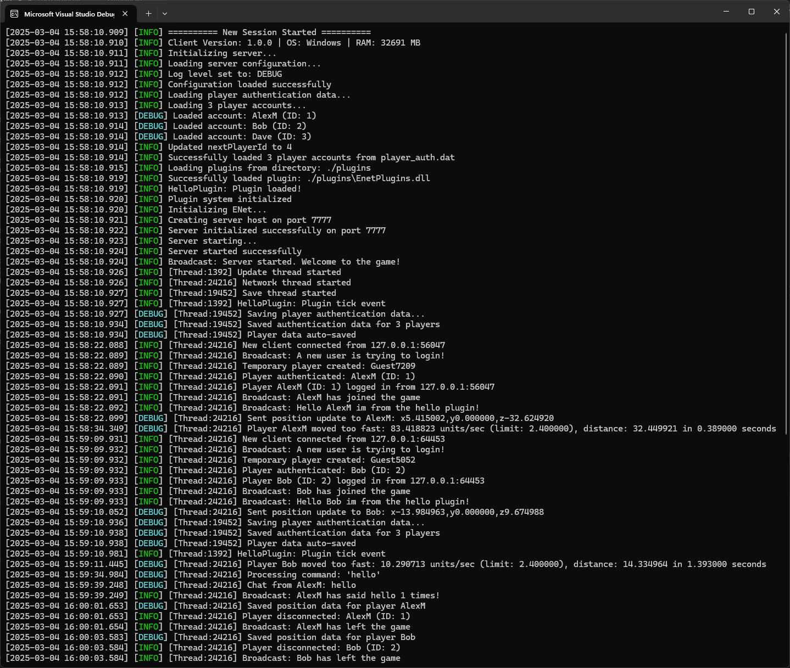
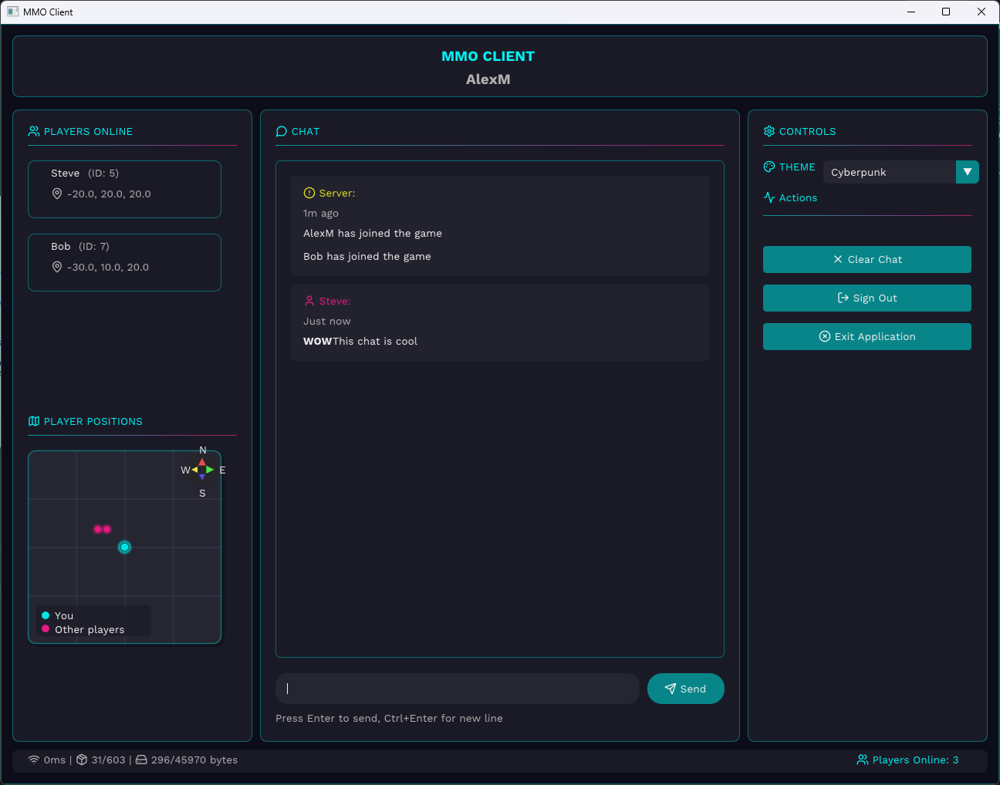

<div align="center">
  <h1>🌐 EnetPlayGround</h1>
  <p><strong>A Networking Sandbox for ENet Protocol Experimentation</strong></p>
  
  <p>
    <a href="#-about">📋 About</a> •
    <a href="#-features">✨ Features</a> •
    <a href="#-screenshots">📸 Screenshots</a> •
    <a href="#-tools-and-libraries">🔧 Tools & Libraries</a> •
    <a href="#-installation">💻 Installation</a> •
    <a href="#-usage">🚀 Usage</a> •
    <a href="#-development-roadmap">🛣️ Development Roadmap</a> •
    <a href="#-research-areas">🔬 Research Areas</a>
  </p>
  
  
  
  
</div>

---

## 📋 About

EnetPlayGround is an experimental platform for exploring networking concepts using the ENet reliable UDP networking library. This project was developed to investigate the challenges and complexities of network programming in the context of multiplayer game development.

The primary focus of this sandbox is to test various networking approaches, understand performance limitations, and implement scalable client-server architecture patterns.

## ✨ Features

<table>
  <tr>
    <td width="50%">
      <h3>🖥️ Server Components</h3>
      <ul>
        <li>🔌 Multi-client connection management</li>
        <li>⚡ Robust event handling system</li>
        <li>📦 Reliable packet delivery implementation</li>
        <li>📢 Broadcast messaging infrastructure</li>
        <li>🗄️ MySQL database integration</li>
        <li>🧩 Plugin architecture support (.dll drop in)</li>
      </ul>
    </td>
    <td width="50%">
      <h3>📱 Client Implementation</h3>
      <ul>
        <li>🔄 Connection stability management</li>
        <li>⏱️ Game state synchronization</li>
        <li>📝 Comprehensive logging system</li>
        <li>⚙️ Configurable network parameters</li>
        <li>🖼️ Graphical user interface</li>
        <li>🗺️ Position visualization</li>
        <li>🖌️ Theming system</li>
      </ul>
    </td>
  </tr>
</table>

## 📸 Screenshots

<div align="center">
  <table>
    <tr>
      <td width="33%">
        
        <p align="center"><i>Server console displaying connected clients and active plugins</i></p>
      </td>
      <td width="33%">
        
        <p align="center"><i>Client authentication interface</i></p>
      </td>
      <td width="33%">
        
        <p align="center"><i>Client interface with inter-client communication</i></p>
      </td>
    </tr>
  </table>
</div>

## 🔧 Tools and Libraries

### 📚 Core Dependencies
- **🌐 ENet**: Reliable UDP networking library for client-server communication
- **🖌️ Hello ImGui**: Cross-platform GUI library for interface development
- **🗃️ MySQL Connector**: Database connectivity for persistent storage
- **🔧 Thread-Pool**: A modern, fast, lightweight thread pool library based on C++20

### 🛠️ Development Tools
- **📦 vcpkg**: C++ package manager for dependency management
- **🏗️ Visual Studio 2022**: IDE for C++ development

## 💻 Installation

### 📋 Prerequisites
- Visual Studio 2022 (or newer)
- C++17 compatible compiler
- CMake 3.20+
- vcpkg
- Git

### 🔄 Setup Process

1. **📥 Clone the repository**
   ```bash
   git clone https://github.com/alexmollard/EnetPlayGround.git
   cd EnetPlayGround
   ```

2. **⚙️ Configure vcpkg**
   ```bash
   # Install vcpkg in a directory accessible to all projects
   # Example: "C:\Users\<UserName>\vcpkg"
   git clone https://github.com/Microsoft/vcpkg.git
   cd vcpkg
   .\bootstrap-vcpkg.bat
   .\vcpkg integrate install
   ```

   - Add the vcpkg directory to your PATH environment variable
   - Alternatively, set VCPKG_ROOT environment variable to your vcpkg installation path

3. **📦 Install required dependencies**
   ```bash
   .\vcpkg install enet
   .\vcpkg install hello-imgui
   .\vcpkg install libmysql
   .\vcpkg install nlohmann-json
   ```

4. **🔨 Build the projects**
   - Open `EnetServer/EnetServer.sln` for the server component
   - Open `EnetClient/EnetClient.sln` for the client component
   - Build with Visual Studio (Ctrl+Shift+B)

## 🚀 Usage

### ⚙️ Server Configuration

The server can operate with a MySQL database backend or with a local file system for data storage. Two configuration methods are available:

#### 🔐 Environment Variables
- `GAME_DB_HOST`: Database server address (defaults to `localhost`)
- `GAME_DB_USER`: Database username (defaults to `gameserver`)
- `GAME_DB_PASSWORD`: Database password
- `GAME_DB_NAME`: Database name (defaults to `gameserver`)
- `GAME_DB_PORT`: Database port (defaults to `3306`)

#### 📄 Configuration File
As an alternative to environment variables, settings can be defined in `server_config.cfg` located in the server executable directory.

### 🏃‍♂️ Running the Application

1. **🖥️ Start the server**
   - Launch the compiled server executable
   - Verify successful initialization without errors

2. **📱 Connect clients**
   - Start client instances
   - Connect to the server using the appropriate address and port
   - Test inter-client communication

## 🛣️ Development Roadmap

- [x] Core client-server communication
- [x] Multi-client messaging
- [x] Position data synchronization
- [x] Error handling system
- [x] Authentication functionality
- [x] Direct messaging between clients
- [x] Administrative controls
- [x] Position visualization
- [x] Plugin infrastructure
- [x] Database integration
- [x] Server multi-threading optimization
- [x] Controlled server shutdown process
- [ ] Fix bug where a client can leave and the server spams game state updates until clients start crashing
- [ ] Enhanced security implementation
- [ ] Improved error recovery mechanisms
- [ ] Administrative graphical interface

## 🔬 Research Areas

EnetPlayGround serves as a platform for investigating various networking challenges:

- 📈 Network capacity and scaling limits
- 🔄 Concurrency management under high loads
- 🔌 Recovery from connection interruptions
- 📏 Message size optimization
- ⏱️ Latency impact assessment
- 💻 Hardware requirements analysis
- 🌊 Network flood resistance
- 🛡️ Client isolation implementation
- 🔒 Security impact on performance

## ❓ Frequently Asked Questions

<details>
<summary><b>🤔 Why was ENet selected as the networking library?</b></summary>
ENet provides a reliable UDP implementation that balances performance with reliability, making it suitable for real-time applications that require guaranteed delivery. and there wasnt many other options available at the time of my single google search.
</details>

<details>
<summary><b>📊 What is the project development status?</b></summary>..
The project is in active development with continuous improvements to stability, performance, and feature set.
</details>

<details>
<summary><b>📄 Can this codebase be used in other projects?</b></summary>
Yes, the code is available for use and modification in other projects, though it is primarily designed as an experimental platform. I wouldnt recommend it right now.
</details>

<details>
<summary><b>🏭 Is this suitable for production environments?</b></summary>
The current implementation is intended for research and development purposes and requires additional hardening before production deployment.
PLEASE DO NOT USE THIS IN PRODUCTION!
</details>

<details>
<summary><b>👥 What is the concurrent user capacity?</b></summary>
I have only tested with 5 local clients and 2 remote clients, but im unsure of the maximum capacity. The server is designed to handle multiple clients.
</details>

---

<div align="center">
  <p><sub>💻 Developed with a focus on networking performance and reliability</sub></p>
  
  <br>
  
</div>